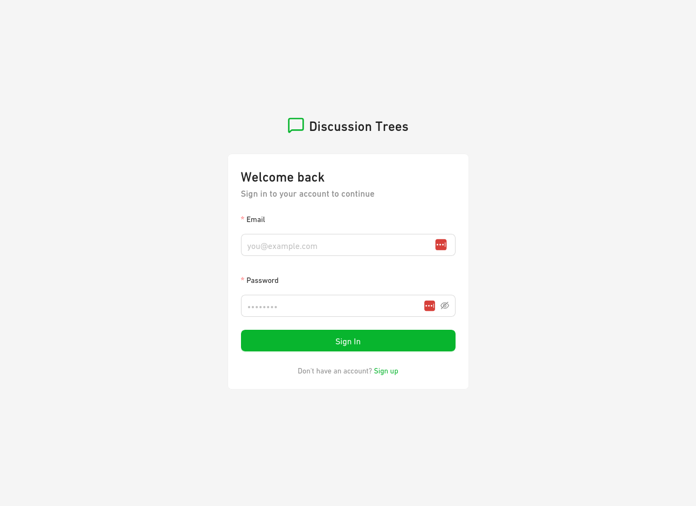
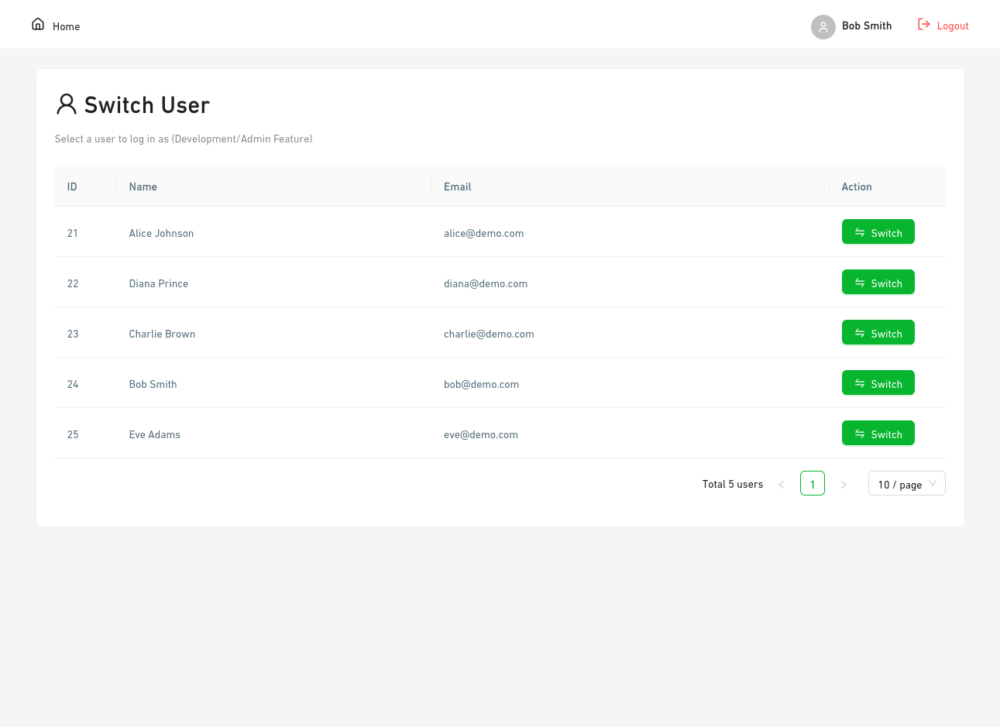
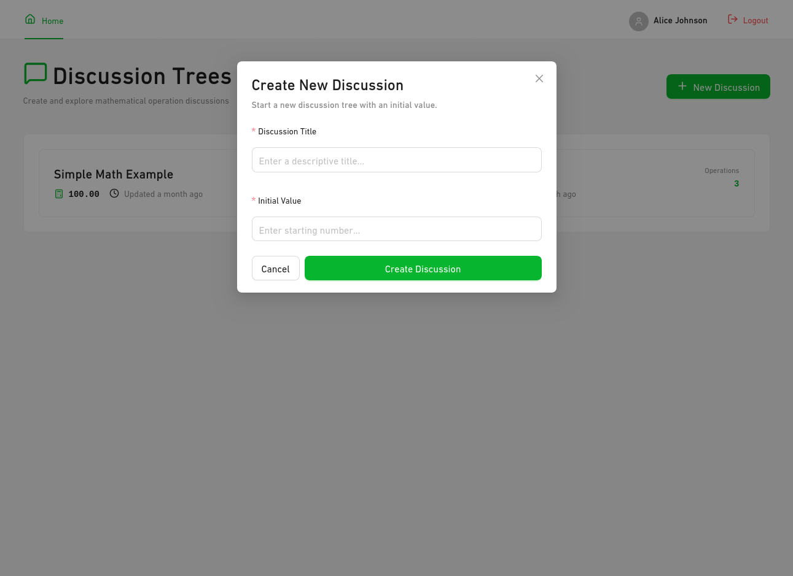
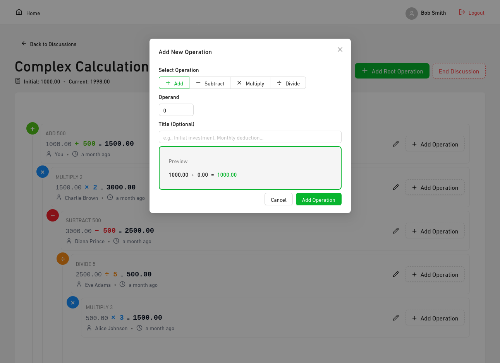
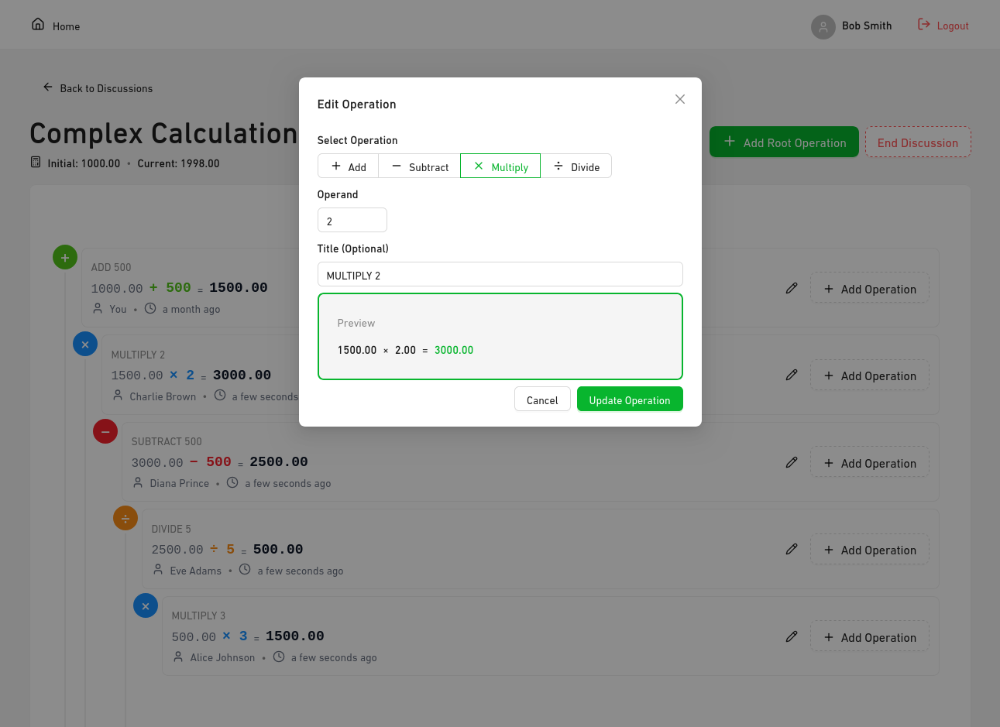
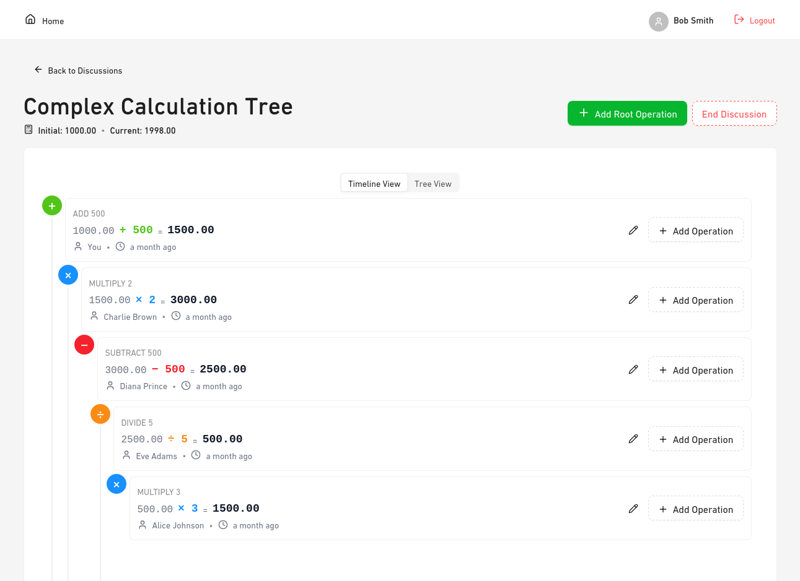
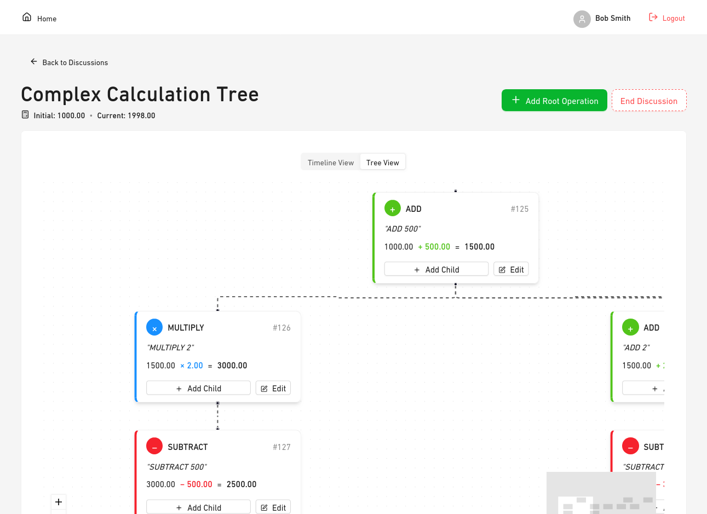
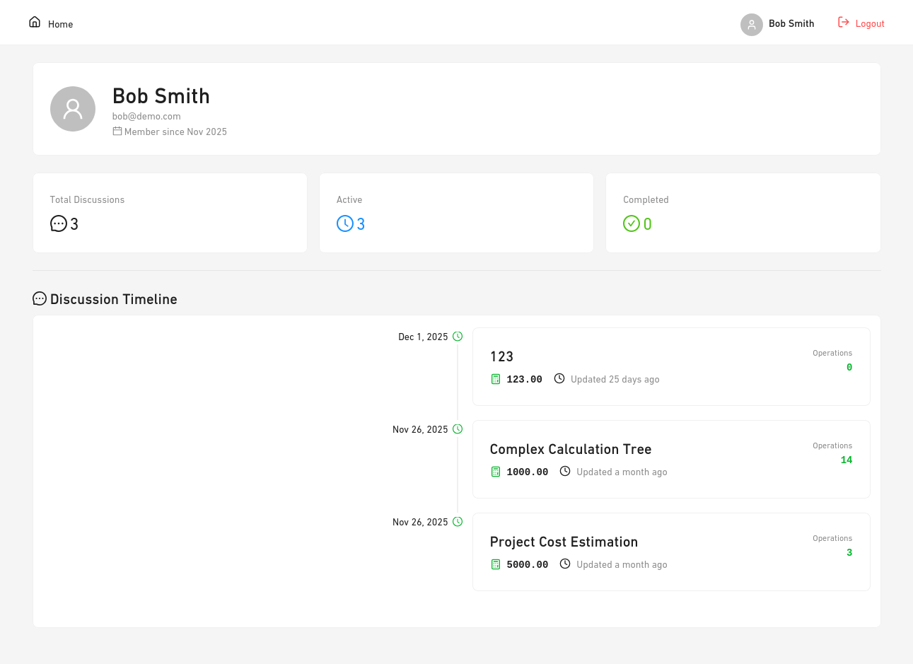

# Ramify 🌳

**Ramify** is a sophisticated full-stack collaboration platform where users communicate through mathematical operations. It transforms simple numbers into complex, interactive calculation trees, allowing teams to visualize the impact of every decision and deduction in real-time.

Built as a premium demonstration for the **Ellty Full-Stack Developer Test Assignment**, Ramify showcases advanced data structures, recursive algorithmic thinking, and modern UI/UX design.

---

## 📸 Project Showcase

### **Main Workspace**

.png>)

---

## 🔐 Authentication & Identity

Secure access and seamless user transitions.

|               Login               |                Register                 |                  Switch User                  |
| :-------------------------------: | :-------------------------------------: | :-------------------------------------------: |
|  |  |  |

---

## 🌳 Core Workflow: Building Trees

Transform values through intuitive operations.

### 1. Discussion Creation

Start a new calculation journey with a base value.


### 2. Managing Operations

Add and modify mathematical expressions with live calculation previews.

|                    Add Operation                     |                   Edit Operation                    |
| :--------------------------------------------------: | :-------------------------------------------------: |
|  |  |

---

## 📊 Dual Visualization Modes

Analyze your math from different perspectives.

### Timeline View

A logical, sequential breakdown of how the total value evolved.


### Tree View

A graphical representation of complex nested dependencies.


---

## 👤 Profile & System

Polished user experience across every corner of the app.

|             User Profile              |           404 Error Page           |
| :-----------------------------------: | :--------------------------------: |
|  |  |

---

## 🚀 Key Features

- **⚡ Recalculation Engine**: Updating a middle node automatically cascades changes to all descendants using a topological-sort algorithm.
- **🛡️ Data Integrity**: All tree updates are atomic and wrapped in PostgreSQL transactions via Prisma.
- **🎨 Premium UI**: Built with Ant Design for a clean, consistent, and enterprise-ready aesthetic.
- **🧪 Live Previews**: Real-time math calculation feedback within the Operation Modal.

---

## 🛠️ Technical Stack

| Layer        | Tech                                       |
| ------------ | ------------------------------------------ |
| **Backend**  | Node.js, Express, TypeScript, Prisma (ORM) |
| **Frontend** | React, Vite, TypeScript, Ant Design        |
| **Database** | PostgreSQL                                 |
| **Auth**     | JWT + bcrypt                               |
| **DevOps**   | Docker Compose                             |

---

## 🧬 Algorithm Deep-Dive: Tree Recalculation

When an operation is modified:

1. **Discovery**: Recursively identifies all affected descendant nodes.
2. **Topological Sort**: Determines the correct sequence of calculation (parents before children).
3. **Atomic Update**: Iteratively updates values within a single database transaction to prevent data corruption.

---

## 🏗️ Project Organization

```text
ramify/
├── backend/           # Core API & Recalculation Logic
├── frontend/          # React App & Modern UI Components
├── docs/images/       # Documentation Visuals
└── docker-compose.yml # Infrastructure Setup
```

---

## 🏁 Quick Start

### 1. Development Mode (Live Reload)

Ideal for active coding. Everything runs in Docker with Hot Module Replacement (HMR). Tables are created automatically on startup.

```bash
docker compose up -d

# Seed the database with demo users (required for first run)
docker compose exec backend yarn prisma:seed
```

- **Frontend**: [http://localhost:5173](http://localhost:5173)
- **Backend**: [http://localhost:8080](http://localhost:8080)

### 2. Production Mode (Optimized)

Ideal for testing final performance and Nginx stability.

```bash
docker compose -f docker-compose.yml -f docker-compose.prod.yml up -d
```

### 🧹 Cleaning Up / Resetting

To wipe everything including the database volumes and start fresh:

```bash
docker compose down -v
```

---

## 👤 Author

**Mohammed Taysser**

- **GitHub**: [@mohammed-taysser](https://github.com/mohammed-taysser)
- **Email**: [mohammedtaysser983@gmail.com](mailto:mohammedtaysser983@gmail.com)
- **Portfolio**: [mohammed-taysser.github.io](https://mohammed-taysser.github.io/portfolio)
